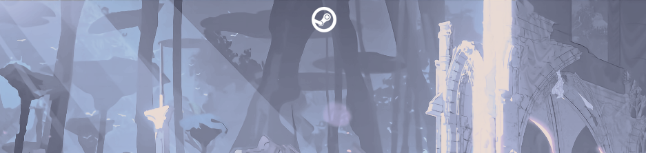

# Minimalist SteamyRain Toggle Launcher

A heavily optimized and modified layout of the **SteamyRain** Rainmeter skin framework. It anchors a single, floating Steam button to the center top of your wallpaper, using a clean left-click macro to toggle a vertical game grid layout in and out of view.

## Features
* **Single-Click Fade Animation:** Re-coded from the original double-click swap to trigger a smooth fade toggle instantly via `!ToggleFadeGroup`.
* **Native Steam Right-Click:** Right-clicking the logo still directly launches your local Steam desktop client.

## Credits & Appreciation
* Original Skin Framework engine designed by **warodev** / **Nookz** ([Original Rainmeter Forums Thread](https://rainmeter.net)).
* Modified and compiled by me for a clean, cinematic desktop workspace.

## Layout Demonstration

| Hidden State (Icon Only) | Expanded State (Game Cards) |
| :---: | :---: |
|  |  |

